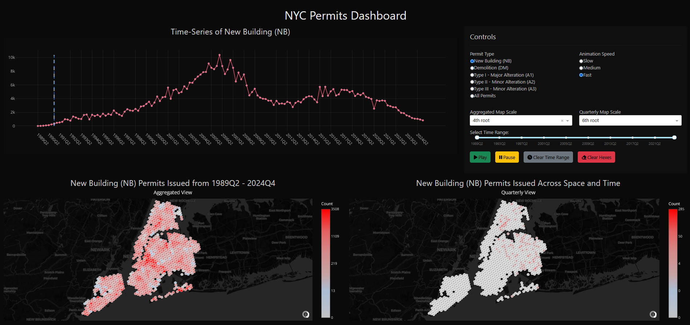

# NYC Building Permit Dashboard

An interactive dashboard for exploring and monitoring NYC building permit data. This project harnesses modern web development tools and sophisticated data processing techniques to deliver dynamic insights into permit issuance trends and geographic distributions across New York City.

[](https://www.python.org/downloads/)
[](https://opensource.org/licenses/MIT)
[](https://codecov.io/gh/dleather/nyc_building_permit_dashboard)
[](https://github.com/dleather/nyc_building_permit_dashboard/actions/workflows/ci.yml)
[](https://nyc-permits-dashboard.daveleather.com/)

---

## Overview

The **NYC Building Permit Dashboard** is a responsive web application built with [Dash](https://dash.plotly.com/) and [Plotly](https://plotly.com/python/). It converts public building permit records into clean, actionable visualizations using tools such as [GeoPandas](https://geopandas.org/) and [pandas](https://pandas.pydata.org/). Whether you're looking to monitor trend shifts or review spatial distributions, the dashboard makes data exploration straightforward through:

- **Interactive Time-Series Analysis:** Easily chart permit issuance over time with dynamic, user-friendly visualizations.
- **Choropleth Mapping:** Visualize the geographic footprint of permits across NYC with detailed, hexagonal maps.
- **Dynamic Filtering:** Adjust views instantly by permit type and time period via intuitive controls.
- **Robust Engineering:** A modular architecture ensures scalability, maintainability, and a smooth user experience.



---

## Features

- **Synchronized Interactive Maps:**
  - Dual map views with synchronized panning, zooming, and rotation
  - Square and lasso selection tools for precise area analysis
  - Real-time synchronization between aggregated and quarterly views

- **Advanced Data Selection:**
  - Interactive hex-based geographic selection
  - Cross-filtering between time series and map views
  - Persistent selections across view changes

- **Intuitive Controls:**
  - Play/pause animation controls for temporal analysis
  - Adjustable animation speed and time range
  - One-click clearing of selections and filters
  - Customizable color scale controls for data visualization

- **Responsive Visualizations:** 
  - Real-time updates and crisp graphics that bring urban data to life
  - Automatic scaling and layout adjustment for all screen sizes
  - Smooth transitions between different data views

- **Advanced Geospatial Mapping:** 
  - Hexagonal binning using Uber's H3 library for precise spatial analysis
  - Multiple selection tools for detailed area studies
  - Synchronized dual-map interface for comparative analysis

- **Optimized Data Processing:** 
  - Intelligent aggregation and filtering for large datasets
  - Efficient handling of temporal and spatial data
  - Real-time updates without performance lag

- **Modular Architecture:**
  - Clean separation of concerns for easy maintenance
  - Event-driven design for responsive interactions
  - Extensible component structure for future enhancements

- **Developer-Friendly:**
  - Comprehensive logging system
  - Built-in debugging tools
  - Clear callback structure for easy modifications

---

## Installation

### Prerequisites

- Python >= 3.13
- [pip](https://pip.pypa.io/)
- (Optional) A virtual environment tool such as [venv](https://docs.python.org/3/library/venv.html) or [conda](https://docs.conda.io/).

### Setup Instructions

1. **Clone the Repository:**

   ```bash
   git clone https://github.com/yourusername/nyc-building-permit-dashboard.git
   cd nyc-building-permit-dashboard
   ```

2. **Create a Virtual Environment (Recommended):**

   ```bash
   python -m venv venv
   source venv/bin/activate  # On Windows use: venv\Scripts\activate
   ```

3. **Install Dependencies:**

   The dependencies are managed via a `pyproject.toml` file. Install them using:

   ```bash
   pip install -e .
   ```

   Alternatively, if you use a requirements file:

   ```bash
   pip install -r requirements.txt
   ```

4. **Verify Data Files:**

   Ensure the processed data is located in the `data/processed` directory. This should include:
   - `nyc_hexes.geojson` – the geospatial grid for NYC
   - `permits_wide.csv` – permit counts data

---

## Usage

To launch the dashboard locally, run:

```bash
python src/app.py
```

The app will start on [http://127.0.0.1:8050](http://127.0.0.1:8050). Open this link in your browser to explore the dashboard.

---

## Project Structure

```
.
├── assets
│   ├── background.png         # Image assets
│   └── style.css              # Custom CSS styles
├── codebase.md                # Project tree view and documentation
├── data
│   └── processed              # Preprocessed geospatial and permit data
│       ├── nyc_hexes.geojson
│       └── permits_wide.csv
├── pyproject.toml             # Project configuration and dependency management
├── run_codeweaver.bat         # Batch script for documentation generation (Windows)
├── src
│   ├── app.py                 # Application entry point
│   ├── app_instance.py        # Dash app and server instance setup
│   ├── callbacks.py           # Interactive component callbacks
│   ├── config.py              # Configuration settings
│   ├── data_utils.py          # Data processing and visualization utility functions
│   ├── debug.py               # Debugging tools
│   └── layout.py              # Dashboard layout definitions
└── uv.lock                    # Dependency lock file
```

---

## Technology Stack

- **Python** – Primary programming language.
- **Dash & Plotly** – For crafting interactive, web-based visualizations.
- **GeoPandas & Pandas** – Efficiently handle data manipulation and geospatial analysis.
- **Dash Bootstrap Components** – For responsive, attractive UI designs.
- **Uvicorn & ASGI** – (Optional) For deploying the app in an asynchronous production environment.

---

## Technical Highlights

- **Optimized Data Handling:** Efficient processing pipelines to work with extensive datasets without lag.
- **Interactive Analytics:** Visualization techniques geared toward clarity and precision for urban data insights.
- **Scalable Architecture:** A modular setup that supports seamless updates and feature integrations.
- **Built-in Debugging:** Extensive logging and debugging capabilities shorten the development cycle.

---

## Contributing

Contributions, issues, and feature requests are welcome! Feel free to check the [issues page](https://github.com/yourusername/nyc-building-permit-dashboard/issues) to report bugs or propose improvements.

1. Fork the repository.
2. Create a new branch (`git checkout -b feature/your-feature`).
3. Commit your changes (`git commit -m 'Add new feature'`).
4. Push to your branch (`git push origin feature/your-feature`).
5. Open a Pull Request.

---

## License

This project is licensed under the MIT License. See the [LICENSE](LICENSE) file for details.

---

## Author

Created by [David Leather](https://daveleather.com). Explore more work and connect on [GitHub](https://github.com/dleather).

---

Happy exploring!
